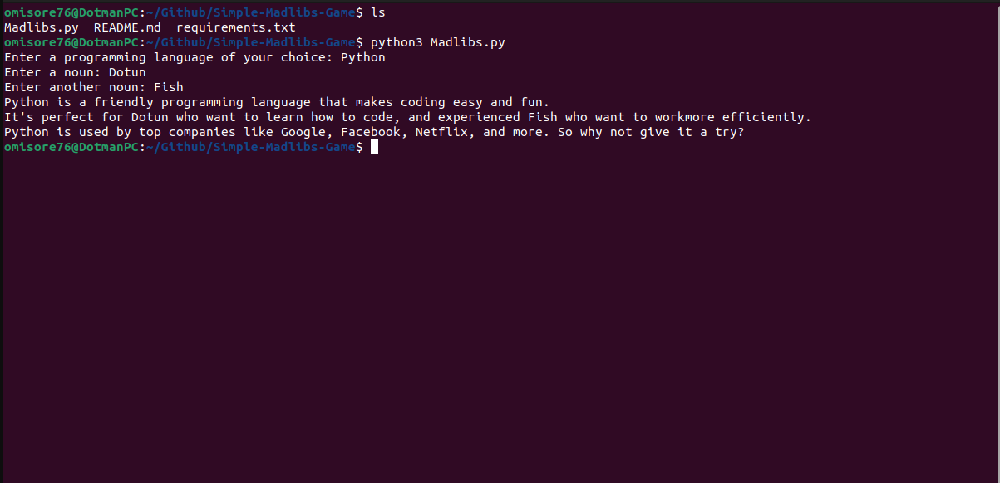

# Simple-Madlibs-Game

## Introduction
You will love this simple game.

Madlibs is a classic word game that has been enjoyed by children and adults for decades. The basic premise of the game is simple: one player prompts another for a series of words, which are then used to create a silly story. However, the fun of Madlibs lies in the fact that the words chosen can often lead to hilariously unexpected results. In addition to providing endless entertainment, Madlibs can also be used as a tool to teach children about parts of speech and proper grammar usage. Whether you're young or old, Madlibs is sure to provide you with a fun and enlightening experience.



## Prerequisite
- Python3 installed on your local address

## How to Use This Repo

- Fork the repo

- Clone it on your local machine

- While in the project repo on your local machine, create a virtual environment. Run the code below to create a virtual environment
```
	python3 -m venv venv_001
```
- Activate the virtual environment
```
	source venv_001/bin/activate
```
- Install requirements
```
	pip install -r requirements.txt
```
- Run the app
```
	python3 Madlibs.py
```
- Enter the necessary information when prompted

- Finally, deactivate the virtual environment once done 
```
deactivate
```
